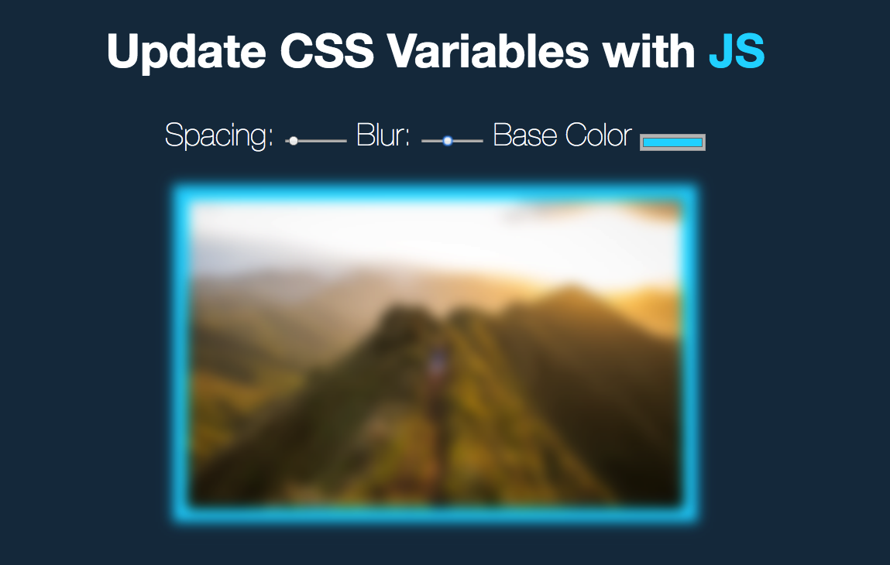

<h1 align="center">
 
  
   
     
  Accessing and Modifying CSS Variables With Javascript
   
</h1>

<h4 align="center">An Image Editor</h4>

- CSS variables
- All of the data attributes can be accessed using `dataset`
- `QuerySelectorAll` returns a NodeList, which is kind of like an Array, except that it’s not
- CSS Custom Properties can be changed using the `setProperty` method

